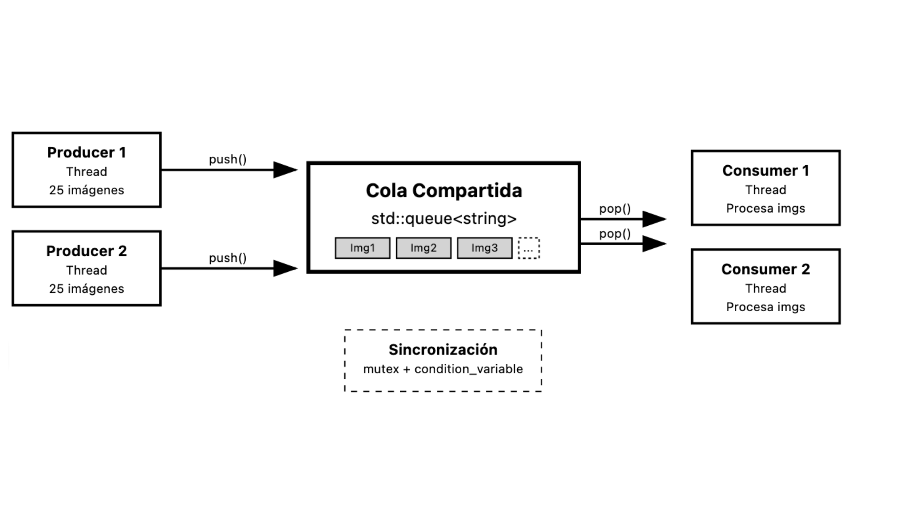
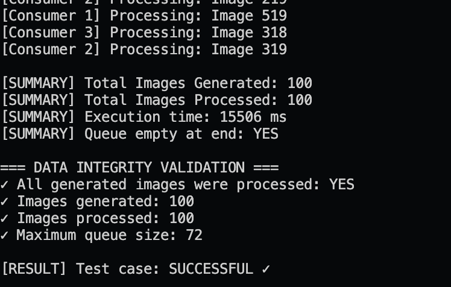

# Evidence 4 Demonstration of a Programming Paradigm
Ian Hernández Hernández - A01276755

## Description
This project simulates an application that receives and processes images concurrently. Multiple threads (producers) generate image data, and multiple threads (consumers) process them. A shared queue is used for communication between producers and consumers, ensuring synchronization with mutexes and condition variables.

This pattern is widely used in real-time data processing systems, web servers, multimedia, streaming applications, and concurrent back-end systems.

Goals:
	•	Safety: Ensure correct access to shared resources without race conditions.
	•	Fairness: Serve image requests in order of arrival (FIFO).
	•	Efficiency: Maximize resource utilization and responsiveness through multithreading.

### System Overview
1. Core Components
	•	Producers: Threads that simulate new image generation requests at random intervals.
	•	Consumers: Threads that process each image request with a simulated delay.
	•	Shared Queue: A synchronized queue used to store and retrieve image tasks safely.
	•	Mutex and Condition Variable: Ensure safe concurrent access and control over thread waiting/wakeup.

2. Operational Flow
	1.	Multiple producer threads generate tasks (e.g., "Image 1", "Image 2"…) and push them to the queue.
	2.	Consumer threads wait for tasks. When available, they pop and simulate processing them.
	3.	If the queue is empty, consumers wait until a new task arrives.
	4.	Mutex locks and condition variables ensure no race conditions occur during access.

##  Model
Paradigm: Concurrent Programming in C++

### Why Concurrent Programming?
This problem involves multiple producers (simulating image uploads) and multiple consumers (simulating image processing), all operating simultaneously. To handle these parallel activities efficiently, we need a model where threads can work independently but share resources safely.

Concurrent programming allows us to:
1. Perform multiple tasks at the same time, improving responsiveness and throughput.
2. Share a common resource (the image queue) between threads in a controlled way.
3. Coordinate producer and consumer activity without data loss or race conditions.

This model is common in real-world systems like web servers, background processors, or live data streams, where different tasks must run simultaneously and communicate safely.

Here's a diagram of the solution for a better understanding of what we'll be doing

### Key Concepts Used:
	• Thread – Used to launch multiple producer and consumer threads.
	• Mutex – Ensures only one thread accesses the shared queue at a time (prevents race conditions).
	• Condition_variable – Lets threads wait and notify each other efficiently (e.g., consumers wait until the queue has images).

## Implementation
The solution is implemented in C++, leveraging its robust support for the concurrent programming paradigm. This allows the use of threads, mutexes, condition variables, and atomic operations to manage synchronization, ensure safe access to shared resources, and simulate real-world parallel execution effectively.

We'll need a C++ compiler with C++11 support or higher (like g++), compatible with Linux, macOS, or Windows with a terminal, then we'll run de program either in the compailer or from the console with g++ evidence04.cpp -o evidence04 and then ./evidence04

## Test
### Test Cases
#### 1. Concurrent Access - Limited Capacity
• Producers: 10
• Consumers: 1
• Images per producer: 5

#### 2. Excess Producers over Consumers
• Producers: 10
• Consumers: 2
• Images per producer: 5

#### 3. Multiple Consumers - Few Producers
• Producers: 2
• Consumers: 10
• Images per producer: 3

#### 4. Balanced Distribution
• Producers: 3
• Consumers: 3
• Images per producer: 4

#### 5. Clean Termination - Stress Test
• Producers: 5
• Consumers: 3
• Images per producer: 20 

#### 6. Single Producer - Multiple Consumers
• Producers: 1
• Consumers: 5
• Images per producer: 10

	• Multiple Producers, Single Consumer: Ensures proper queuing and wake-up.
	• Single Producer, Multiple Consumers: Confirms fair consumption and no starvation.
	• Empty Queue Handling: Consumers wait without errors until data is available.
### Validation Metrics
	• All generated images are processed.
	• No data races or crashes observed under stress testing.
	• Final queue is empty after all tasks are completed.

## Analysis

### Time Complexity

Production and consumption: O(1) per operation (insertion or removal from the queue). However, the total execution time depends on the simulated (random) delays. Thanks to thread synchronization using mutexes and condition variables, the shared queue is accessed in a safe and efficient manner, even with multiple threads running concurrently.

The O(1) complexity comes from the underlying queue data structure (std::queue in C++), which allows constant-time insertion and deletion. The use of threads does not change this complexity—it simply enables operations to occur concurrently. Proper synchronization ensures that these O(1) operations remain correct and do not result in race conditions.

### Other possible paradigms tha could solve the problem

#### Logic (Prolog)
Viable here: No

Not suitable for concurrency or dynamic I/O handling.

#### Scripting (Shell)
Viable here: No

Difficult to coordinate multiple tasks with precise synchronization.

#### Functional (Scheme)
Viable here: Partially

Possible with functional threads, but complex to manage shared resources.

#### Parallel (OpenMP)
Viable here: Yes

Suitable if processing were purely parallel without shared queues.

### Explanation:

 * Logic Programming (Prolog): Great for rule-based problems, but not designed for concurrent operations or real-time data flow.
 * Scripting (Shell): Useful for automation and simple task pipelines, but lacks the tools for fine-grained thread control or shared data protection.
 * Functional Programming (Scheme): Supports concurrency through immutability and pure functions, but sharing mutable state (like a queue) is tricky and error-prone.
 * Parallel Programming (OpenMP): Effective for data-parallel tasks (e.g., matrix operations), but less ideal for producer-consumer patterns that require shared state coordination.
